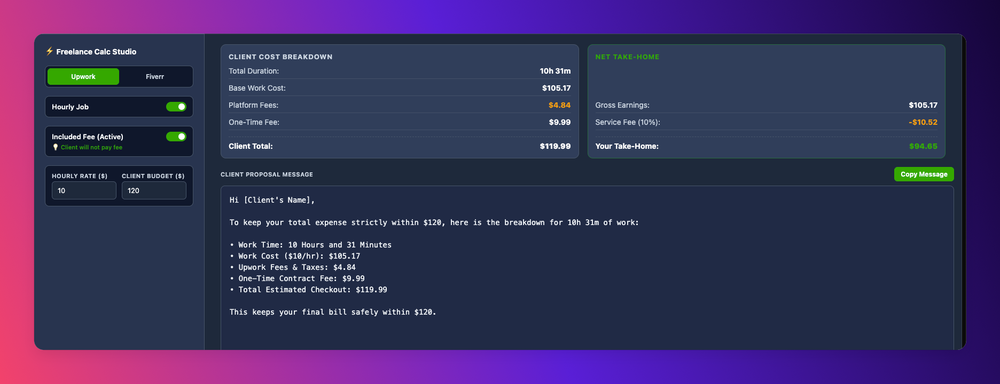

# Budget Calculator

A clean, personal tool built exclusively for my occasional freelance workflow to calculate Upwork and Fiverr client costs, platform fees, and net take-home earnings instantly.

## Preview

## Why I Built This
As a freelancer, I occasionally need a quick way to figure out exact project pricing, fee distributions, and generate ready-to-copy client proposal messages without manual math. This custom dashboard streamlines that exact process for me.
